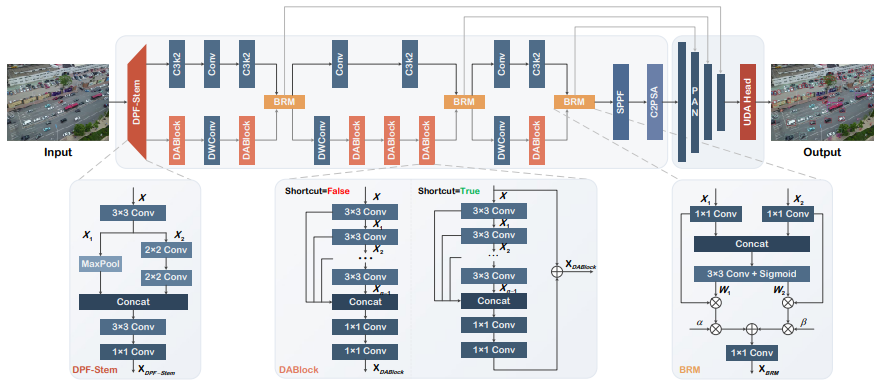
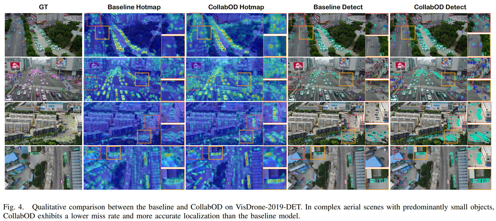
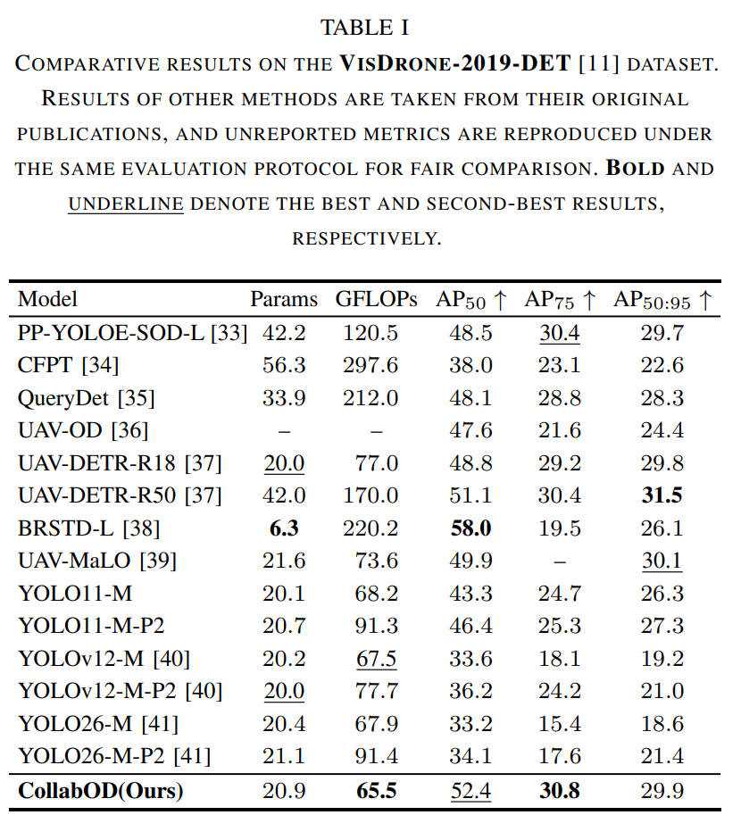

<div align="center">


<h3><span style="color: #1F77FF;">Collab</span>orative Multi-Backbone with Cross-scale Vision for UAV Small <span style="color: #FF8C42;">O</span>bject <span style="color: #FF8C42;">D</span>etection</h3>

<p>
  <b>Xuecheng Bai</b><sup>1,*,&dagger;</sup>,
  <b>Yuxiang Wang</b><sup>2,*</sup>,
  <b>Chuanzhi Xu</b><sup>2,&dagger;</sup>,
  <b>Boyu Hu</b><sup>3</sup>,
  <b>Kang Han</b><sup>1,4</sup>,
  <b>Ruijie Pan</b><sup>1</sup>,<br>
  <b>Xiaowei Niu</b><sup>5</sup>,
  <b>Xiaotian Guan</b><sup>5</sup>,
  <b>Liqiang Fu</b><sup>5</sup>,
  <b>Pengfei Ye</b><sup>6</sup>
</p>

<p>
  <sup>*</sup> Equal contribution.&nbsp;&nbsp;
  <sup>&dagger;</sup> Corresponding authors.
</p>

<p>
  <sup>1</sup> <b>Aviation Traffic Control Technology (SHENZHEN) Co., Ltd., Shenzhen, China<br>
  <sup>2</sup> The University of Sydney, NSW, Australia<br>
  <sup>3</sup> The University of International Business and Economics, Beijing, China<br>
  <sup>4</sup> Research Institute of Traffic Control Technology Co., Ltd., Beijing, China<br>
  <sup>5</sup> Guoneng Shuohuang Railway Development Co., Ltd., Hebei, China<br>
  <sup>6</sup> The Hong Kong University of Science and Technology, Hong Kong, China</b>
</p>
</div>

<div align='center'>
    <a href='https://arxiv.org/abs/2603.05905'></a>
  
  
  
</div>

<p align="center">

</p>

## 🔥🔥🔥 News 🔥🔥🔥

- **2026.03.06:** Paper is available at [***arXiv***](https://arxiv.org/abs/2603.05905). Please refer to it for more details.

- **2026.03.05:** We launched ***CollabOD***, a hight-precision lightweight ***UAV Object Detection*** method.

## Introduction

> Small object detection in unmanned aerial vehicle (UAV) imagery is challenging, mainly due to scale variation, structural detail degradation, and limited computational resources. In high-altitude scenarios, fine-grained features are further weakened during hierarchical downsampling and cross-scale fusion, resulting in unstable localization and reduced robustness. To address this issue, we propose CollabOD, a lightweight collaborative detection framework that explicitly preserves structural details and aligns heterogeneous feature streams before multi-scale fusion. The framework integrates Structural Detail Preservation, Cross-Path Feature Alignment, and Localization-Aware Lightweight Design strategies. From the perspectives of image processing, channel structure, and lightweight design, it optimizes the architecture of conventional UAV perception models. The proposed design enhances representation stability while maintaining efficient inference. A unified detail-aware detection head further improves regression robustness without introducing additional deployment overhead.

**Key Points:**

- We develop a lightweight detection framework ***CollabOD*** that jointly enhances structural details and aligns heterogeneous feature streams, ensuring stable localization and high detection accuracy for small objects under limited computational budgets.

- We design a ***Dual-Path Fusion Stem (DPF-Stem)*** and a ***Dense Aggregation Block (DABlock)*** to mitigate the progressive degradation of localization-related structural information in deep networks, preserving boundary and contour cues at the input stage while compensating for hierarchical feature attenuation.

- We introduce a ***Bilateral Reweighting Module (BRM)*** that improves cross-scale feature consistency through channel-wise adaptive weight generation and learnable scaling.

- We propose a ***Unified Detail-Aware Head (UDA-Head)*** that enhances boundary regression via detailaware convolution and employs re-parameterization to eliminate additional inference overhead.

## 📖 File Description

- `train.py`: Training script for CollabOD, supporting both single-GPU and multi-GPU training.
- `val.py`: Validation script for evaluating trained models and exporting paper-ready metrics.
- `detect.py`: Inference script for running object detection on images or other input sources.
- `check_yaml`: Used to verify the correctness of the CollabOD model YAML file by initializing a detection model from the given configuration.
- `ultralytics/cfg/models/CollabOD.yaml`: Model configuration file for CollabOD.

## 🚀 Enviroment

```bash
git clone https://github.com/Bai-Xuecheng/CollabOD.git
cd CollabOD
conda create -n CollabOD python==3.10 -y
conda activate CollabOD
pip install -r requirements.txt
```

## ⚒️ Training

We provide a training script for **CollabOD** that supports flexible configuration through command-line arguments, including **model definition**, **dataset configuration**, **image size**, **number of epochs**, **batch size**, **optimizer**, and **device settings**.

Before training, please make sure that a valid **GPU training environment** is available and that the `dataset.yaml` file is configured correctly.

- Single-GPU Training
```bash
python train.py \
    --model_yaml ./ultralytics/cfg/models/CollabOD.yaml \
    --data_yaml Path/to/the/dataset.yaml \
    --imgsz 640 \
    --epochs 500 \
    --batch 8 \
    --device 0
```
- Multi-GPU Training
```bash
python train.py \
    --model_yaml ./ultralytics/cfg/models/CollabOD.yaml \
    --data_yaml Path/to/the/dataset.yaml \
    --imgsz 640 \
    --epochs 500 \
    --batch 8 \
    --device 0,1,2,3
```

## 📊 Validation 
We provide a validation script to evaluate trained **CollabOD** models and export paper-ready results. The script supports flexible configuration via command-line arguments, such as **model weights**, **dataset YAML**, **validation split**, **image size**, **batch size**, and **device settings**. The following command can be used: 

```bash
python val.py \
  --model Path/to/the/model.pt \
  --data Path/to/the/dataset.yaml \
  --split val \
  --imgsz 640 \
  --batch 16 \
  --device 0 \
  --project runs/val \
  --name exp
```

After evaluation, it summarizes both model complexity and detection performance, including **GFLOPs**, **parameters**, **model size**, **speed statistics**, **FPS**, and **per-class / overall detection metrics**. The formatted results are displayed in the terminal and saved as `paper_data.txt` for further analysis and reporting.

## 👀 Detection

We provide a detection script for **CollabOD** to perform inference on images or other supported input sources. The script supports flexible configuration via command-line arguments, including **model weights**, **input source**, **image size**, **confidence threshold**, **IoU threshold**, **output directory**, and **device settings**.

```bash
python detect.py \
    --model_path Path/to/the/model.pt \
    --source Path/to/the/images \
    --imgsz 640 \
    --conf 0.25 \
    --iou 0.45
```

## 🕹️ Results
<div align="center">


</div>

## Acknowledgement
This work is built on [ultralytics](https://github.com/ultralytics/ultralytics). Thanks for their excellent open-source contributions. This work was also supported by the project ***Key Technologies for Automatic Inspection and Evaluation of Railway Infrastructure Based on UAV Nest Systems*** (Grant No. SHTL-25-48), funded by **Guoneng Shuohuang Railway Development Co., Ltd**.

## Contact
If you have any questions, please contact ***Xuecheng Bai*** or ***Chuanzhi Xu*** by e-mail (bai_xuecheng@163.com; xhuanzhi.xu@sydney.edu.au).

## Citation
If you find our work useful for your research, please consider giving a star and citing the paper:

```bibtex
@misc{bai2026collabodcollaborativemultibackbonecrossscale,
      title={CollabOD: Collaborative Multi-Backbone with Cross-scale Vision for UAV Small Object Detection}, 
      author={Xuecheng Bai and Yuxiang Wang and Chuanzhi Xu and Boyu Hu and Kang Han and Ruijie Pan and Xiaowei Niu and Xiaotian Guan and Liqiang Fu and Pengfei Ye},
      year={2026},
      eprint={2603.05905},
      archivePrefix={arXiv},
      primaryClass={cs.CV},
      url={https://arxiv.org/abs/2603.05905}, 
}
```